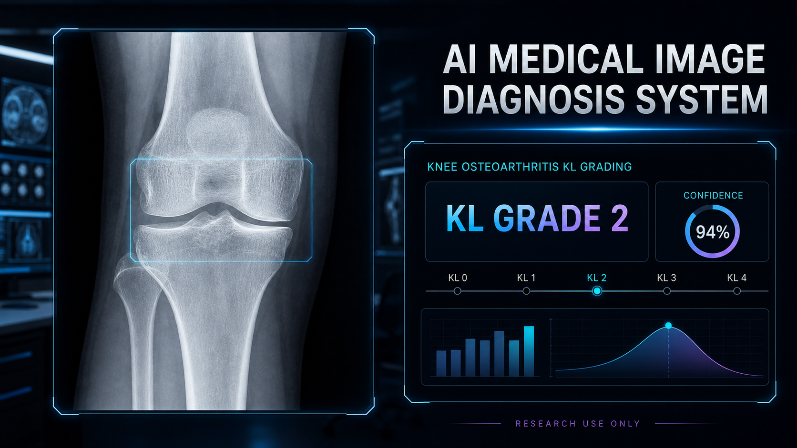
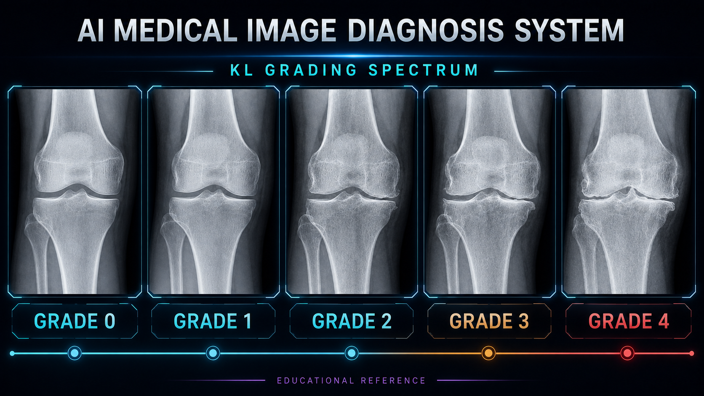
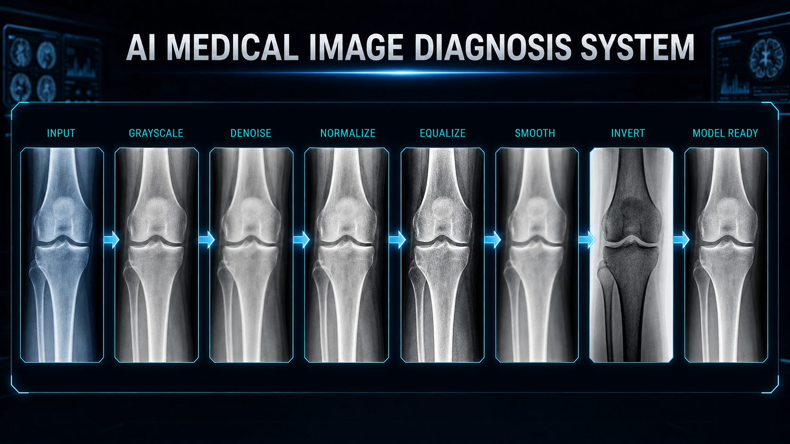
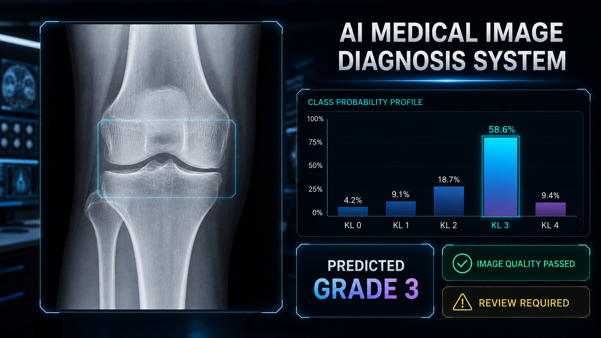
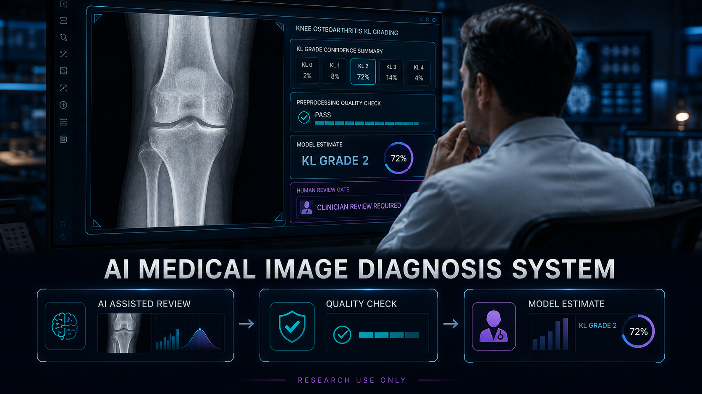

<div align="center">



# 🩻 AI Medical Image Diagnosis System

### AI-assisted knee X-ray analysis with Kellgren–Lawrence severity grading

**Medical imaging · Five-class classification · Explainable workflow · Human review**

<p>
  
  
  
  
  
  
</p>

[Overview](#-executive-summary) · [Capabilities](#-core-capabilities) · [Visuals](#-visual-system-showcase) · [Workflow](#-inference-workflow) · [Setup](#-quick-start) · [Safety](#%EF%B8%8F-responsible-use--limitations) · [Developer](#-developer--maintainer)

</div>

---

> [!CAUTION]
> **Research and education only.** This project is not a medical device and must not be used to diagnose, exclude, or treat disease. Every output requires review by a qualified healthcare professional. A model confidence score is not a clinical probability.

## 🎯 Executive Summary

The **AI Medical Image Diagnosis System** is a portfolio-ready computer-vision application that classifies knee radiographs into **Kellgren–Lawrence (KL) grades 0–4**. It combines a FastAI learner with a reproducible OpenCV preprocessing pipeline and a lightweight Streamlit interface.

The workflow accepts either a provided test image or an uploaded knee X-ray, prepares the image for inference, then returns a predicted KL class and model confidence. The interface is designed as **decision support for research**, with human review positioned as the final and essential step.

### 📊 At a Glance

| Area | Implementation |
|---|---|
| 🩻 **Input** | Knee radiograph selected from test samples or uploaded by the user |
| 🧠 **Task** | Five-class image classification: KL grades `0`, `1`, `2`, `3`, `4` |
| ⚙️ **Model runtime** | Serialized FastAI learner loaded from `model.pkl` |
| 🧪 **Image preparation** | Grayscale, denoise, normalize, equalize, smooth, and invert |
| 🖥️ **Interface** | Interactive Streamlit application |
| 📤 **Output** | Predicted grade plus model confidence |
| 👩‍⚕️ **Final decision** | Qualified clinician review—not automated diagnosis |

---

## ✨ Core Capabilities

- 🩻 **Knee X-ray classification** across the five KL severity categories.
- 📁 **Flexible image input** through built-in examples or user uploads.
- 🧹 **Consistent preprocessing** using OpenCV before model inference.
- 🧠 **FastAI model loading** from the included serialized learner.
- 📈 **Readable prediction output** with a class label and confidence value.
- 🖥️ **Browser-based experience** powered by Streamlit.
- 🔍 **Transparent pipeline documentation** for reproducibility and review.
- 👩‍⚕️ **Human-in-the-loop framing** appropriate for responsible medical-AI research.

---

## 🖼️ Visual System Showcase

> [!NOTE]
> The visuals below are **conceptual product previews** created for project documentation. They are not screenshots of the current Streamlit application, real patient records, validated radiographs, or evidence of clinical performance.

### 1. 🩻 KL Grading Spectrum



The system frames classification as a five-level severity spectrum, while keeping clinical interpretation outside the automated workflow.

### 2. 🧪 Reproducible Preprocessing



Every input follows the same transformation sequence to reduce variation before it reaches the learner.

### 3. 📊 Model Output & Confidence



The concept dashboard makes class competition visible. In the current source application, the primary output is the predicted label and its model confidence.

### 4. 👩‍⚕️ Human Review Workflow



AI output is treated as supporting information. Image quality, patient context, differential diagnosis, and final interpretation remain clinician responsibilities.

---

## 🦴 Kellgren–Lawrence Reference

The KL scale is a radiographic framework used to describe knee osteoarthritis severity. The shorthand below is included only to explain the model labels.

| Grade | Educational description | Typical radiographic pattern |
|:---:|---|---|
| **0** | No radiographic evidence | No definite osteoarthritic change |
| **1** | Doubtful | Possible osteophyte formation and doubtful joint-space narrowing |
| **2** | Mild | Definite osteophytes with possible joint-space narrowing |
| **3** | Moderate | Multiple osteophytes, definite narrowing, some sclerosis, and possible bony deformity |
| **4** | Severe | Large osteophytes, marked narrowing, severe sclerosis, and definite bony deformity |

> [!IMPORTANT]
> KL grading is one part of radiographic assessment. Symptoms, examination, image acquisition, alternate findings, and specialist judgment must also be considered. See this [peer-reviewed KL classification review](https://pubmed.ncbi.nlm.nih.gov/26872913/) for clinical context.

---

## 🔄 Inference Workflow

```text
Test image or user upload
          │
          ▼
Load image with Pillow and convert to RGB
          │
          ▼
OpenCV preprocessing pipeline
          │
          ▼
FastAI learner loaded from model.pkl
          │
          ▼
Predicted KL grade + model confidence
          │
          ▼
Qualified human review
```

### 🧹 Preprocessing Sequence

The source application applies these operations in order:

1. Convert the radiograph to **grayscale**.
2. Reduce noise with **fast non-local means denoising**.
3. Normalize pixel intensity to the **0–255** range.
4. Apply **histogram equalization** for contrast adjustment.
5. Smooth the result with a **5 × 5 Gaussian blur**.
6. Apply **intensity inversion** before inference.

This sequence is part of the deployed input contract. Changes to it can shift the model’s input distribution and should be validated before use.

---

## 🏗️ System Architecture

| Layer | Responsibility |
|---|---|
| 🖥️ **Streamlit UI** | Image selection, upload controls, preview, and result presentation |
| 🖼️ **Pillow** | Image decoding and RGB conversion |
| 👁️ **OpenCV** | Denoising, normalization, enhancement, smoothing, and inversion |
| 🧠 **FastAI** | Learner deserialization and image classification |
| 💾 **Model artifact** | Stores the trained inference learner in `model.pkl` |
| 👩‍⚕️ **Human review** | Interprets output in the appropriate clinical and patient context |

### 📂 Project Structure

```text
AI-Medical-Image-Diagnosis-System/
├── app.py                              # Streamlit inference application
├── model.pkl                           # Serialized FastAI learner
├── requirements.txt                    # Runtime dependencies
├── AIB.ipynb                           # Project experimentation notebook
├── Visiontransformer_Knee_OA_KL.ipynb  # Vision Transformer exploration
├── images/                             # Sample radiographs used by the app
├── assets/                             # README concept visuals
├── logo.png                            # Project branding asset
├── AIB_Logo.png                        # AI Builders program logo
├── LICENSE                             # MIT License
└── README.md                           # Project documentation
```

---

## 🚀 Quick Start

### Prerequisites

- Python 3.x
- A supported local environment for FastAI and Streamlit
- The repository’s included `model.pkl` artifact

### Windows PowerShell

```powershell
git clone https://github.com/AsadAliEng/AI-Medical-Image-Diagnosis-System.git
cd AI-Medical-Image-Diagnosis-System

python -m venv .venv
.\.venv\Scripts\Activate.ps1

python -m pip install --upgrade pip
pip install -r requirements.txt

streamlit run app.py
```

Streamlit will print the local application URL in the terminal, commonly `http://localhost:8501`.

### 🧭 Basic Usage

1. Start the Streamlit application.
2. Select a bundled test image or upload a supported knee X-ray image.
3. Review the input preview and run inference.
4. Read the predicted KL grade and confidence value.
5. Treat the result as a research output and obtain qualified clinical review.

---

## 🧰 Technology Stack

| Technology | Role |
|---|---|
| 🐍 **Python** | Application and inference runtime |
| 🧠 **FastAI** | Model loading and prediction |
| 🔥 **PyTorch** | Deep-learning backend used by FastAI |
| 👁️ **OpenCV** | Radiograph preprocessing |
| 🖼️ **Pillow** | Image loading and conversion |
| 🖥️ **Streamlit** | Interactive web interface |
| 🔢 **NumPy** | Array and pixel operations |

The source dependency definitions are available in [`requirements.txt`](requirements.txt), while the executable inference flow lives in [`app.py`](app.py).

---

## 🧪 Validation Checklist

Before evaluating or extending the system, verify:

- [ ] The model artifact loads without serialization or dependency errors.
- [ ] Supported image formats decode correctly.
- [ ] The preprocessing order exactly matches training expectations.
- [ ] Predictions are tested on data separated from training data.
- [ ] Performance is reported per class, not only as overall accuracy.
- [ ] Calibration, subgroup behavior, and failure cases are reviewed.
- [ ] No patient-identifying information is committed or logged.
- [ ] A qualified expert reviews outputs in any healthcare-related study.

---

## ⚠️ Responsible Use & Limitations

- **Not a diagnosis:** Output must never replace a radiologist, physician, or complete clinical assessment.
- **No verified performance claim here:** This README intentionally does not invent accuracy, sensitivity, specificity, or deployment-readiness metrics.
- **Domain shift:** Scanner type, acquisition protocol, image orientation, demographics, implants, artifacts, and preprocessing differences can affect predictions.
- **Early-grade ambiguity:** Adjacent KL grades—especially early disease—can be difficult to distinguish and may have observer variability.
- **Confidence is limited:** A high model confidence does not guarantee correctness, clinical significance, or safety.
- **Privacy matters:** Use de-identified data and follow applicable institutional, legal, and ethical requirements.
- **External validation is required:** Clinical use would require rigorous independent validation, calibration, governance, monitoring, and regulatory review.

---

## 📚 Project Origin, Dataset & Credits

This portfolio presentation preserves the technical and authorship history of the original open-source project.

- 🧬 **Original source:** [OkaShino9/Knee-OA-Classification-by-KL-Grading](https://github.com/OkaShino9/Knee-OA-Classification-by-KL-Grading)
- 👨‍💻 **Original developer:** Chananchai Chanmol
- 🏫 **Program:** AI Builders 2024, organized by VISTEC, Central Digital, and Mahidol University
- 🗂️ **Dataset credit:** [Knee Osteoarthritis Dataset with Severity Grading by Senura Perera](https://www.kaggle.com/datasets/senuraperera/knee-oa-new)
- 📝 **Technical article:** [Knee osteoarthritis classification with FastAI](https://medium.com/@kungkao123456789/knee-osteoarthritis-classification-by-kellgren-and-lawrence-grading-system-with-fast-ai-2738287b0c2e)
- 📄 **License:** The upstream repository is distributed under the [MIT License](LICENSE).

The redesigned visuals in `assets/` are documentation concepts and do not replace original experimental evidence or clinical validation.

---

## 🤝 Contributing

Contributions that improve reproducibility, validation, accessibility, documentation, or responsible-use safeguards are welcome.

1. Fork the repository.
2. Create a focused branch: `git checkout -b feature/your-improvement`.
3. Commit your changes with a clear message.
4. Push the branch and open a pull request.

Please do not commit patient data, private radiographs, secrets, or unlicensed medical imagery.

---

## 👨‍💻 Developer & Maintainer

<div align="center">

<a href="https://github.com/AsadAliEng">
  
</a>

### Asad Ali

**Developer · Repository Maintainer**

<p>
  <a href="https://github.com/AsadAliEng">
    
  </a>
  <a href="mailto:asadali.cryptoeng@gmail.com">
    
  </a>
</p>

| Detail | Information |
|---|---|
| 👤 **Name** | Asad Ali |
| 💻 **GitHub** | [@AsadAliEng](https://github.com/AsadAliEng) |
| 📧 **Email** | [asadali.cryptoeng@gmail.com](mailto:asadali.cryptoeng@gmail.com) |

<sub>Open to technical discussions, collaboration, and responsible computer-vision research.</sub>

</div>

---

<div align="center">

## ⭐ AI Medical Image Diagnosis System

**Analyze · Grade · Review Responsibly**

Built for reproducible medical-imaging research, transparent AI workflows, and human-centered review.

<sub>If this project supports your learning or research, consider starring the repository.</sub>

</div>
